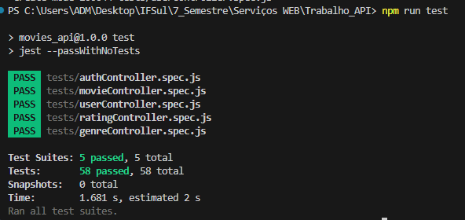
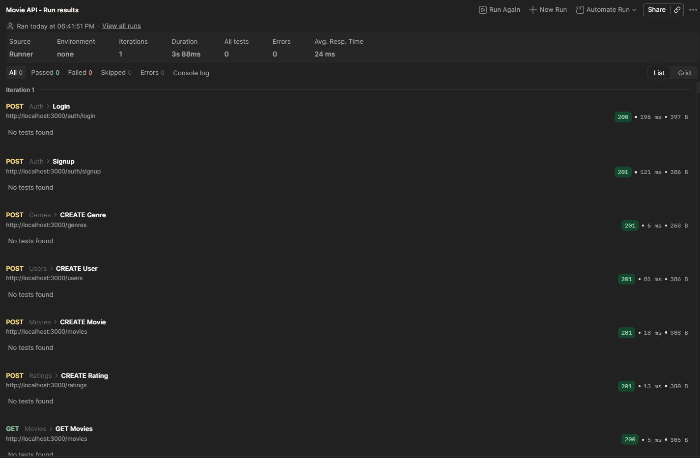
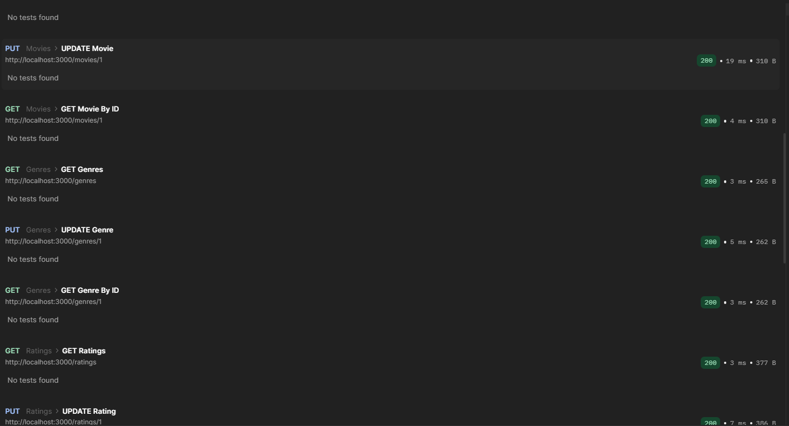
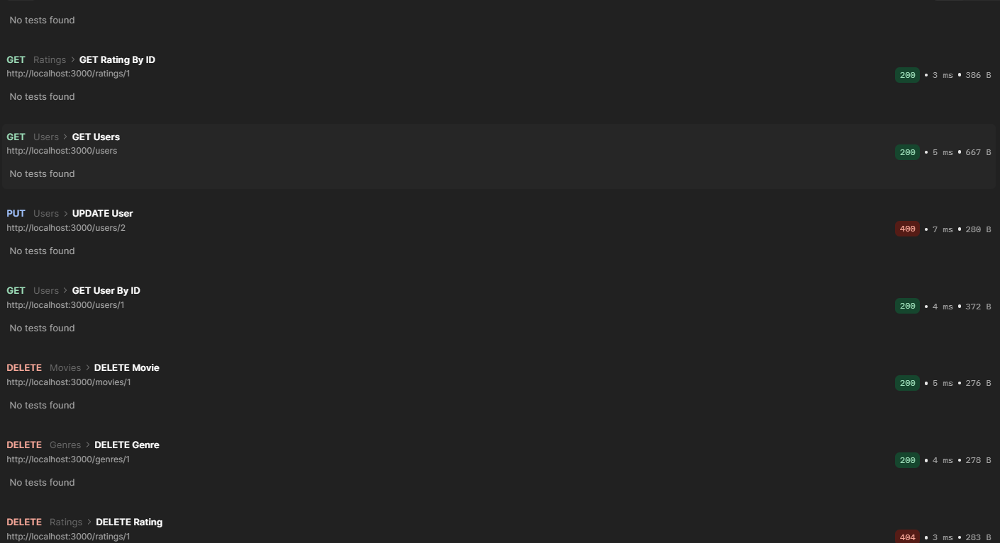
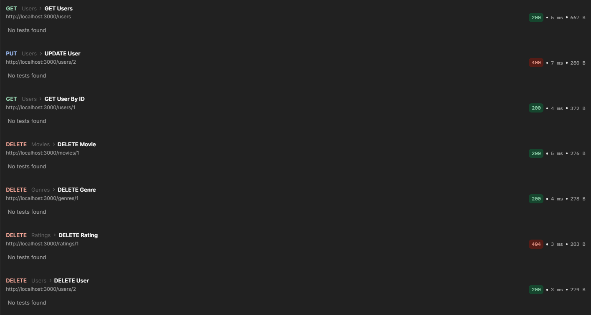

# Movie API

## 1. Descrição do Domínio / Cenário

Esta API foi desenvolvida para gerenciar um sistema de filmes, incluindo usuários, gêneros e avaliações.  
O objetivo principal é permitir que usuários se cadastrem, façam login, avaliem filmes e consultem informações de filmes e gêneros.
**Swagger disponível em: [http://localhost:3000/api-docs](http://localhost:3000/api-docs)**

O domínio contempla:

- **Usuários**: podem ser normais (`role = 0`) ou administradores (`role = 1`). Administradores têm permissões adicionais para criar filmes, gêneros e gerenciar outros usuários.  
- **Filmes**: contêm título e lista de gêneros associados.  
- **Gêneros**: categorias de filmes (ex: Ação, Drama, etc).  
- **Avaliações (Ratings)**: associam usuários a filmes, com nota e comentário opcional.  

---

## 2. Instalação e Execução Local

### Pré-requisitos

- Node.js >= 16  
- npm ou yarn  
- Banco de dados PostgreSQL (configurar em `config/config.json`)

### Passos

1. Clone o repositório:

```bash
git clone https://github.com/WagnerSB/MovieAPI.git
cd MovieAPI
```

2. Instale as dependências:

```bash
npm install
```

3. Configure o banco de dados em config/config.json.
4. Crie a base de dados no PostgreSQL, se ainda não existir:
```bash
CREATE DATABASE movieDB;
```
5. Inicialize o servidor (cria tabelas e usuário admin se necessário):
```bash
npm start
```
Usuário admin padrão criado:
```bash
Email: admin@admin.com
Senha: admin
Role: 1
```

---

## 3. Tabela de Rotas da API
| Recurso | Método | Endpoint | Descrição | Proteção |
|---------|--------|----------|-----------|-----------|
| Auth | POST | `/auth/login` | Login de usuário | Público |
| Auth | POST | `/auth/signup` | Criação de usuário | Público (restrições para role 1) |
| Users | GET | `/users` | Listar todos os usuários | Admin |
| Users | GET | `/users/:id` | Buscar usuário por ID | Próprio usuário ou admin |
| Users | POST | `/users` | Criar usuário | Admin para role 1, público para role 0 |
| Users | PUT | `/users/:id` | Atualizar usuário | Próprio usuário ou admin |
| Users | DELETE | `/users/:id` | Deletar usuário | Próprio usuário ou admin |
| Movies | GET | `/movies` | Listar todos os filmes | Público |
| Movies | GET | `/movies/:id` | Buscar filme por ID | Público |
| Movies | POST | `/movies` | Criar filme | Admin |
| Movies | PUT | `/movies/:id` | Atualizar filme | Admin |
| Movies | DELETE | `/movies/:id` | Remover filme | Admin |
| Genres | GET | `/genres` | Listar todos os gêneros | Público |
| Genres | GET | `/genres/:id` | Buscar gênero por ID | Público |
| Genres | POST | `/genres` | Criar gênero | Admin |
| Genres | PUT | `/genres/:id` | Atualizar gênero | Admin |
| Genres | DELETE | `/genres/:id` | Remover gênero | Admin |
| Ratings | GET | `/ratings` | Listar todas avaliações | Público |
| Ratings | GET | `/ratings/:id` | Buscar avaliação por ID | Público |
| Ratings | POST | `/ratings` | Criar avaliação | Usuário autenticado |
| Ratings | PUT | `/ratings/:id` | Atualizar avaliação | Usuário dono ou admin |
| Ratings | DELETE | `/ratings/:id` | Remover avaliação | Usuário dono ou admin |

---

## 4. Pesquisa e Contextualização

A construção desta API se baseou em boas práticas de desenvolvimento backend moderno, com os seguintes pontos de pesquisa e referência:

- Node.js + Express: framework leve e eficiente para criação de APIs RESTful.
- Sequelize ORM: permite gerenciar banco de dados relacional (MySQL/PostgreSQL) de forma intuitiva, incluindo associações entre tabelas (User, Movie, Genre, Rating).
- Autenticação e Autorização:
  - Tokens JWT para proteger rotas.
  - Controle de roles (0 = user, 1 = admin).
- Validação de Dados:
  - Regras de obrigatoriedade, tipos de dados e integridade de arrays (ex: genres de filmes).
- Testes Automatizados:
  - Jest para testes unitários de controllers e services, cobrindo sucesso, erro e validação.
- Ferramentas de teste externo:
  - Postman para execução de coleções e validação das rotas.

Este projeto serve como base para aplicações de catálogo de filmes, sistemas de avaliações ou qualquer domínio que envolva usuários, permissões e conteúdo categorizado.

---

## 5. Execução de Testes
### 5.1 Testes Unitários com Jest
```bash
npm test
```

Abaixo, uma captura de tela de testes executados com Jest:

## 5.2 Testes via Postman

- Importar a collection `docs/postman/MovieAPI.postman_collection.json`.
- Configurar variáveis:
  - `{{URL}}` – http://localhost:3000
  - `{{token}}` – JWT do login
- Rodar testes manualmente ou pelo Postman Runner.
Abaixo, capturas de tela de testes executados com runner do postman:



